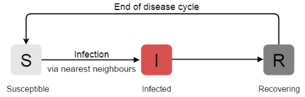
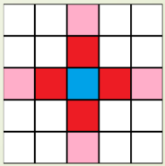

# SIRS model

## variables
curr

#### Von Neumann neighbourhood is used 

## Functions used:-

### Initialization(Point* points)
assigns random values for the tau in the data. 

### main function
Initialize pointer vector points using new keyword