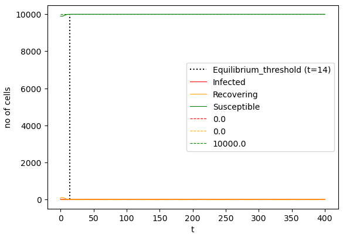
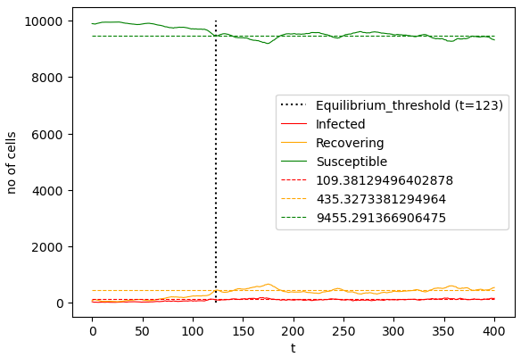
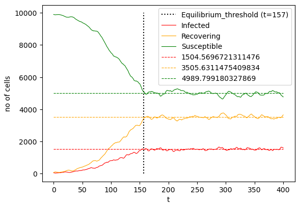
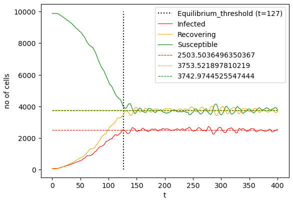
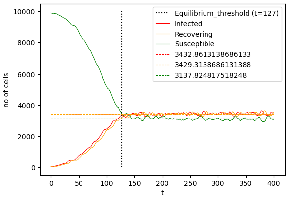
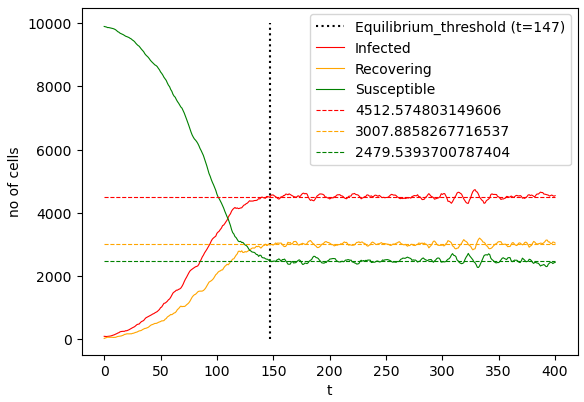
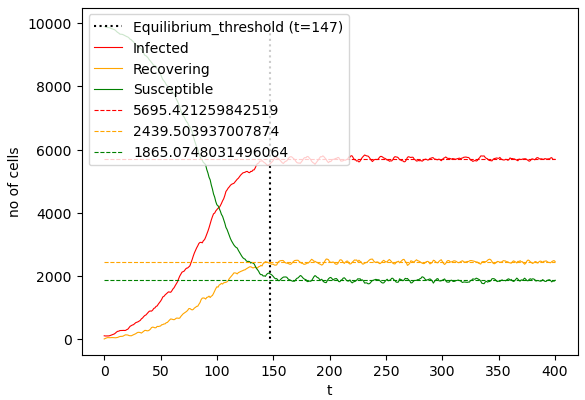
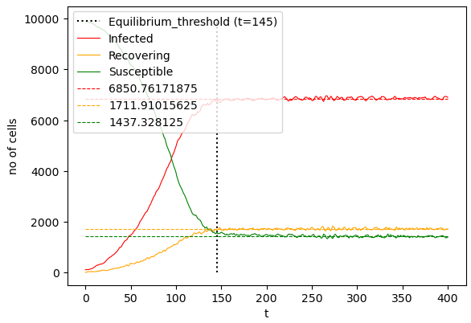
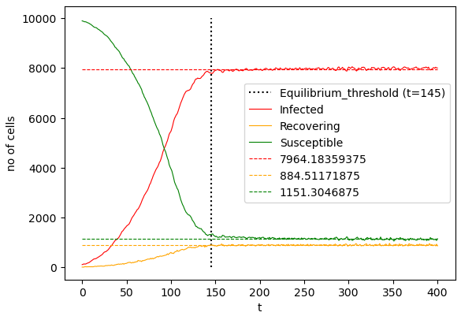
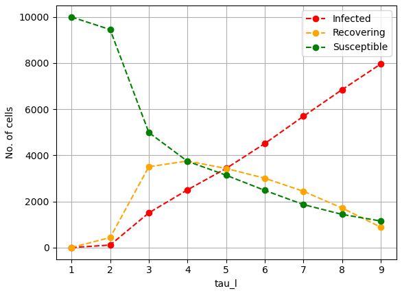

# SIRS model

> Primary code is on SIRS.cpp \
> 'Plotting and analysis.ipynb' has the plots

## Parameters
- tau_l : The point on the grid is infected when the value of $\tau$ is between 1 and tau_l.
- tau_max : The point is recovering when the value is between tau_l and tau_max.
- N : No of grid points in one dimension.

## Variation in tau_l:
Varying the value of tau_l while keeping the initial condiitons and tau_max same. tau_l quantifies the time it takes for an infected person to recover.

- Initial conditions \
Susceptible cells : 9900 \
Infected cells : 69 \
Recovering cells : 31

> tau_l = 1 

> tau_l = 2 

> tau_l = 3 

> tau_l = 4

> tau_l = 5

> tau_l = 6

> tau_l = 7

> tau_l = 8

> tau_l = 9

### tau_l vs no of cells at equilibrium

The general trend is that at equilibrium, the number of infected cells is increasing. This can be shown from the following plot.

